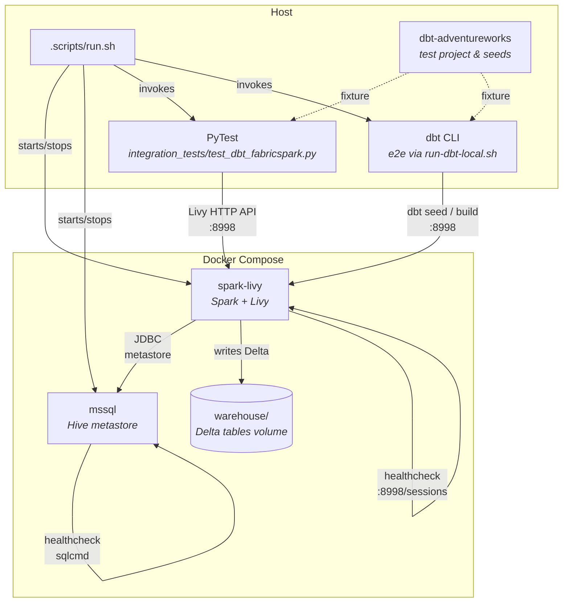

# Contributing to `dbt-fabricspark`

Thanks for your interest in contributing to **dbt-fabricspark**!

## About this document

This guide covers the local development workflow, test infrastructure, and conventions.

This is a guide intended for folks interested in contributing to `dbt-fabricspark`. Below, we document the process by which members of the community should create issues and submit pull requests (PRs) in this repository. It is not intended as a guide for using `dbt-fabricspark`, and it assumes a certain level of familiarity with Python concepts such as virtualenvs, `pip`, Python modules, and so on. This guide assumes you are using macOS or Linux and are comfortable with the command line.

For those wishing to contribute we highly suggest reading the dbt-core's [contribution guide](https://github.com/dbt-labs/dbt-core/blob/HEAD/CONTRIBUTING.md) if you haven't already. Almost all of the information there is applicable to contributing here, too!

## Prerequisites

| Tool                                  | Version | Purpose                 |
| ------------------------------------- | ------- | ----------------------- |
| Python                                | 3.10+   | Runtime                 |
| [uv](https://github.com/astral-sh/uv) | latest  | Package & venv manager  |
| Docker (with Compose v2)              | latest  | Integration & e2e tests |

## Quick start

Run through full development lifecycle:

> venv → build → lint → unit → integration → e2e

```bash
.scripts/run.sh all
```

## Development script

All development tasks go through a single entry-point — [`.scripts/run.sh`](.scripts/run.sh):

```bash
.scripts/run.sh <target>
```

| Target             | What it does                                                |
| ------------------ | ----------------------------------------------------------- |
| `venv`             | Create a fresh virtual environment and install all deps     |
| `build`            | Build the wheel into `dist/*.whl`                           |
| `fix`              | Auto-fix lint issues (`ruff check --fix` + `ruff format`)   |
| `lint`             | Check lint (`ruff check` + `ruff format --check`)           |
| `unit-test`        | Run `pytest tests/unit/` (no Docker required)               |
| `seed-ci`          | Download seed CSV data from GitHub Gist                     |
| `integration-test` | Start Spark+Livy in Docker, run `pytest integration_tests/` |
| `e2e`              | Full dbt CLI lifecycle against a Docker Spark+Livy instance |
| `all`              | Run every target above in sequence                          |

## Getting the code

You will need `git` in order to download and modify the `dbt-fabricspark` source code. You can find directions [here](https://github.com/git-guides/install-git) on how to install `git`.

### External contributors

If you are not a member of the `Microsoft` GitHub organization, you can contribute to `dbt-fabricspark` by forking the `dbt-fabricspark` repository. For a detailed overview on forking, check out the [GitHub docs on forking](https://help.github.com/en/articles/fork-a-repo). In short, you will need to:

1. fork the `dbt-fabricspark` repository
2. clone your fork locally
3. check out a new branch for your proposed changes
4. push changes to your fork
5. open a pull request against `microsoft/dbt-fabricspark` from your forked repository

### Microsoft Org contributors

If you are a member of the `Microsoft` GitHub organization, you will have push access to the `dbt-fabricspark` repo. Rather than forking `dbt-fabricspark` to make your changes, just clone the repository, check out a new branch, and push directly to that branch.

## Running `dbt-fabricspark` in development

### Installation

First make sure that you set up your `virtualenv` as described in [Setting up an environment](https://github.com/dbt-labs/dbt-core/blob/HEAD/CONTRIBUTING.md#setting-up-an-environment). Ensure you have the uv installed with `pip install uv` or via curl.

Next, if this is first time installation of `dbt-fabricspark` with latest dependencies:

```sh
uv pip install -e . --group dev
```

If have installed packages locally using uv pip install, make sure to run uv sync to update the uv.lock file from your environment.

```sh
uv pip install <package>
```

When `dbt-fabricspark` is installed this way, any changes you make to the `dbt-fabricspark` source code will be reflected immediately in your next `dbt-fabricspark` run.

To confirm you have correct version of `dbt-core` installed please run `dbt --version` and `which dbt`.

## Testing

### Initial Setup

`dbt-fabricspark` uses test credentials specified in a `test.env` file in the root of the repository. This `test.env` file is git-ignored, but please be _extra_ careful to never check in credentials or other sensitive information when developing. To create your `test.env` file, copy the provided example file, then supply your relevant credentials.

```
cp test.env.example test.env
$EDITOR test.env
```

### Test commands

```sh
# run all unit tests
uv run pytest tests/unit/ -vv
# run all functional tests (requires Fabric credentials in test.env)
uv run pytest --profile az_cli tests/functional/
# run specific functional tests
uv run pytest --profile az_cli tests/functional/adapter/basic/*
# run a specific unit test
uv run pytest tests/unit/test_adapter.py::TestSparkAdapter::test_profile_with_database
```

## Test architecture

### Overview

The integration tests spin up Spark+Livy and a SQL Server metastore via Docker Compose, and run a dbt project (`dbt-adventureworks`) against the live Spark instance, verifying the full dbt lifecycle including Delta Lake table creation.



### Test categories

| Category        | Directory                    | Docker? | What it validates                                                                           |
| --------------- | ---------------------------- | ------- | ------------------------------------------------------------------------------------------- |
| **Unit**        | `tests/unit/`                | No      | Adapter internals: credentials, columns, Livy session, relations, macros, MLV API           |
| **Functional**  | `tests/functional/`          | No      | dbt materializations against a live Fabric Spark endpoint (requires `test.env` credentials) |
| **Integration** | `integration_tests/`         | Yes     | Full dbt ↔ Spark round-trip: seed, run, test, build via local Docker Compose                |
| **End-to-end**  | `integration_tests/scripts/` | Yes     | dbt CLI lifecycle (`debug → deps → seed → run → test → docs generate`) against Docker       |

### Integration test fixtures (conftest.py)

The PyTest session fixtures handle the Docker lifecycle automatically:

1. **`docker_spark_livy`** — starts Docker Compose, waits for Livy health checks, yields the Livy URL, and tears down on exit
2. **`dbt_project_dir`** — returns the path to the `dbt-adventureworks` project

Set `SPARK_SKIP_DOCKER=1` to skip Docker management and test against an
external Spark+Livy instance.

### Docker Compose services

| Service          | Image                                                 | Ports   | Purpose                                |
| ---------------- | ----------------------------------------------------- | ------- | -------------------------------------- |
| `spark-livy`     | `rakirahman.azurecr.io/devcontainer/spark:2d6281b...` | `8998`  | Spark + Livy API server                |
| `mssql`          | `mcr.microsoft.com/mssql/server:2025-latest`          | `11434` | SQL Server (Hive metastore backend)    |
| `metastore-init` | `mcr.microsoft.com/mssql/server:2025-latest`          | —       | Creates metastore database, then exits |

## Environment variables

| Variable            | Default                 | Used by                   | Description                                                           |
| ------------------- | ----------------------- | ------------------------- | --------------------------------------------------------------------- |
| `LIVY_URL`          | `http://localhost:8998` | `run.sh`, e2e             | Livy API base URL                                                     |
| `SPARK_SKIP_DOCKER` | _(unset)_               | `run.sh integration-test` | Set to `1` to skip Docker start/stop (use an external Spark instance) |
| `SPARK_IMAGE`       | _(prebuilt ACR image)_  | docker-compose            | Docker image for the Spark+Livy container                             |
| `LIVY_PORT`         | `8998`                  | docker-compose            | Host port mapped to the Livy container                                |
| `MSSQL_PORT`        | `11434`                 | docker-compose            | Host port mapped to the SQL Server container                          |
| `SKIP_TEARDOWN`     | _(unset)_               | e2e (`run-dbt-local.sh`)  | Set to `1` to keep Spark+Livy running after the e2e test              |

## Code style

We use [Ruff](https://docs.astral.sh/ruff/) for linting and formatting:

```bash
.scripts/run.sh lint       # check
.scripts/run.sh fix        # auto-fix
```

## Updating Docs

Many changes will require an update to the `dbt-fabricspark` docs — here are some useful resources.

- Docs are [here](https://docs.getdbt.com/).
- The docs repo for making changes is located [here](https://github.com/dbt-labs/docs.getdbt.com).
- The changes made are likely to impact one or both of [Fabric Spark Profile](https://docs.getdbt.com/reference/warehouse-profiles/fabricspark-profile), or [Spark Configs](https://docs.getdbt.com/reference/resource-configs/spark-configs).
- We ask every community member who makes a user-facing change to open an issue or PR regarding doc changes.

## Adding CHANGELOG Entry

Changelogs are managed manually for now. As you raise a PR, provide the changes made in your commits.

## Submitting a Pull Request

Microsoft provides a CI environment to test changes to the `dbt-fabricspark` adapter, and periodic checks against the development version of `dbt-core` through Github Actions.

A `dbt-fabricspark` maintainer will review your PR. They may suggest code revision for style or clarity, or request that you add unit or functional test(s). These are good things! We believe that, with a little bit of help, anyone can contribute high-quality code.

Once all requests and answers have been answered the `dbt-fabricspark` maintainer can trigger CI testing.

Once all tests are passing and your PR has been approved, a `dbt-fabricspark` maintainer will merge your changes into the active development branch. And that's it! Happy developing :tada:
